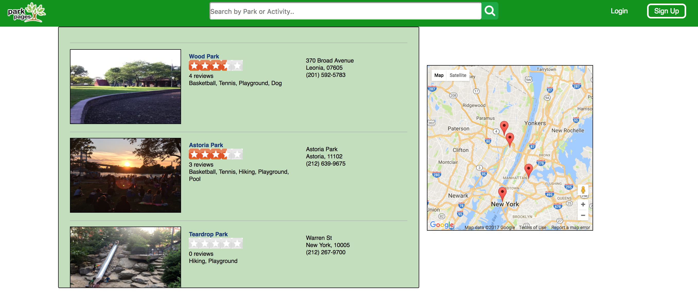
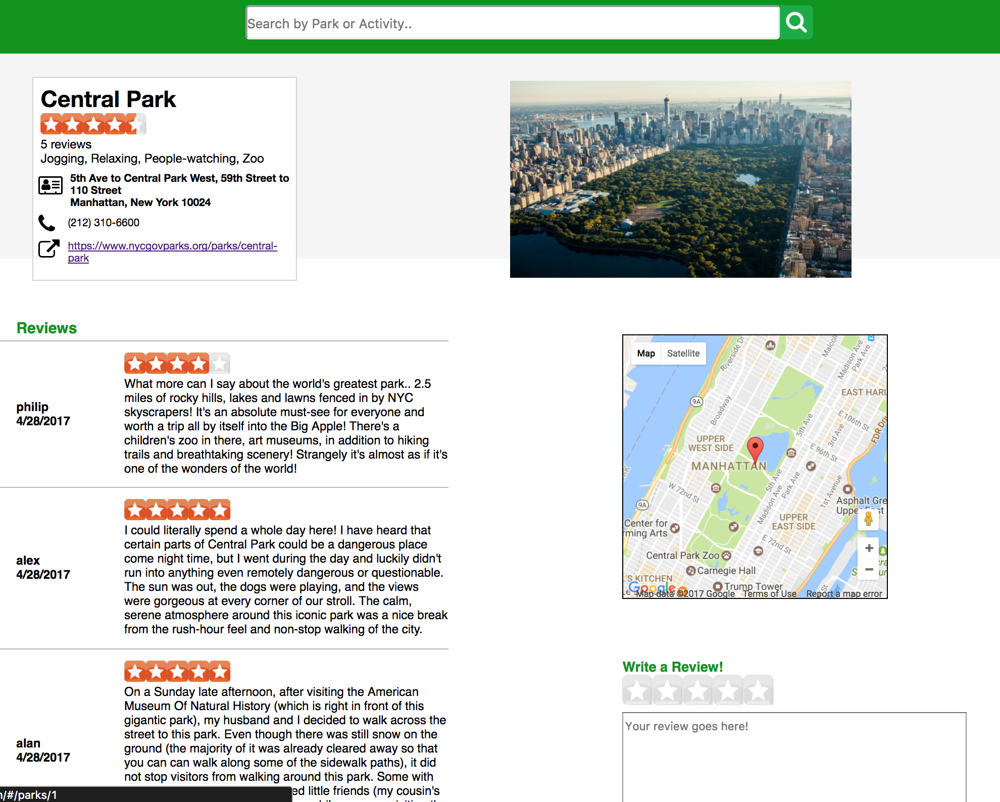

# ParkPages

[ParkPages live][heroku]

[heroku]: http://www.parkpages.us/#/
Welcome to ParkPages - an easy way to find parks in the New York & New Jersey area. ParkPages is a full stack web application based off of Yelp built using React with Redux architectural framework on the frontend and Ruby on Rails on the backend with a PostgreSQL database. ParkPages aims to enhance the user's park-finding experience in the New York/New Jersey area with the ability to read and create reviews for restaurants.

## Libraries
- React.js
- Redux
- pg_search
- BCrypt (for authentication)
- Figaro to securely store keys and other important data
- Paperclip (storing park images on Amazon Web Services)

## Features & Implementation

ParkPages has the following features
- Login / Logout / Guest Login / Sign Up
- List of featured parks on home page
- Search functionality by park name and tag name
- View locations of parks on Google Maps with markers on park index and detail pages
- Add reviews and ratings to parks
- Park detail page with park info, picture, reviews, and new review form


### Search
ParkPages utilizes pg_search to search for parks with whole text. It searches based on Park name and by Park taggings, which are stored in the `tags` table, joined by a `taggings` join table. When a user submits parameters through the search bar and hits submit, the parameters are sent as data with an ajax request to the backend, where then the query string is used to find corresponding parks in the database, searching on the park name and tag name columns. The below image shows the search bar with quicklinks to certain tag searches.

<p align="center">
  
</p>

After a search query is made, an index of all related parks to the query is returned. Below is the result of that search.

<p align="center">
  
</p>

### Reviews
On individual park detail pages, users can write reviews for a park, as long as they are logged in. If they are not, the review form will not be rendered. The below image shows a park detail page with the review form, and the reviews associated with that park.

<p align="center">
  
</p>

### Google Maps
Google Maps is used and displays all locations of parks. Users have the ability search for restaurants and click on markers to display park information. Each park's latitude and longitude coordinates are inputted into the map to render markers for each park location, shown in the code below.

````javascript
this.map = new google.maps.Map(this.mapNode, mapOptions);
newProps.parks.forEach(park => {
  var contentString =
    `<div id="content">${park.name}</div>
    <div> ${park.city}, ${park.state}</div>
    <div> ${park.lat}, ${park.lng}</div>`;

  var infowindow = new google.maps.InfoWindow({
      content: contentString
    });

  var marker = new google.maps.Marker({
    position: { lat: park.lat, lng: park.lng },
    map: this.map
  });
  marker.addListener('click', function() {
    infowindow.open(this.map, marker);
  });
  ````

## Future Implementation Plans

In addition to the features that have been implemented and described above, I plan to continue work by implementing the following features.

### Image Upload & Image Carousel

Image uploading by users is a standard feature of Yelp. Profile images of parks are already stored on Amazon servers, but I plan to add functionality so that users can upload image files which will be added to an image carousel for each Park.

### Mark Reviews as Funny/Cool, etc.

I aim to imeplement the feature so that users will be able to mark reviews with a cartain set of characteristics (funny, cool, helpful, etc.).
